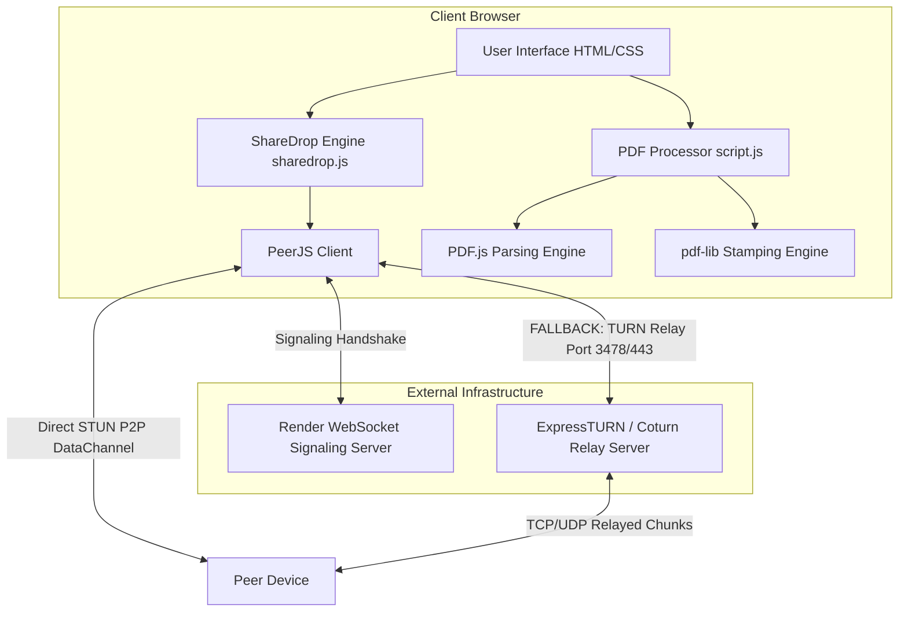

# ⚡ LABLAZY - Web Suite & P2P ShareDrop

[](https://webrtc.org/)
[](https://mozilla.github.io/pdf.js/)
[](LICENSE)
[](https://github.com/)

**LABLAZY** is an all-in-one web application suite featuring an automated **Client-Side PDF Document Editor & Metadata Stamper** alongside **ShareDrop**, a high-performance **Peer-to-Peer (P2P) File Sharing System** built with WebRTC, custom WebSocket signaling, and enterprise TURN relay fallback for strict campus networks.

---

## 🌟 Key Features

### 📄 1. Automated PDF Editor & Metadata Stamper
* **Batch Processing:** Process multiple PDF files simultaneously right in your browser with zero server uploads.
* **Smart Text Detection (PDF.js):** Scans multi-page PDFs to detect baseline coordinates of existing student headers (Name, Moodle ID, Roll No, Class/Div/Branch, Subject, Instructor, Dates, Experiment Numbers).
* **Precise Canvas Whiteout & Re-Stamping (`pdf-lib`):** Erases old text fields with exact bounding-box whiteouts and redraws cleanly formatted, aligned Times New Roman Bold text across every page.
* **Automatic Experiment & Subject Naming:** Automatically extracts experiment numbers and subject names from document content to generate standardized filenames (`student_name_exp1_subject.pdf`).
* **Direct Transfer to ShareDrop:** Transferred PDFs are cached in temporary browser storage (IndexedDB) and can be opened in the PDF Editor with a single click.
* **ZIP Archive Generation:** Compress all stamped PDFs into a single `.zip` file using JSZip for batch submission.

---

### ⚡ 2. ShareDrop (WebRTC Peer-to-Peer File Transfer)
* **Zero-Server Storage:** Files stream directly from sender to receiver in **64 KB binary chunks**. Files are never saved on a third-party server or cloud database.
* **0-Latency Real-Time Streaming:** Receiver's progress bar moves in real-time as chunks arrive, eliminating store-and-forward delays.
* **Campus & College Wi-Fi Bypass (TURN Relay):**
  * Integrated with **ExpressTURN** and **Metered.ca** TURN servers.
  * Bypasses Access Point (AP) / Client Isolation, Symmetric NAT, and UDP firewalls using **TCP on Port 3478 / TURNS Port 443**.
  * Optional `SECURE_P2P_MODE` to bypass local discovery timeouts on strict institutional networks.
* **Interactive Radar Display:** Visual representation of all devices connected to the same room code.
* **Room-Based Discovery:** Custom room codes (e.g., `lobby` or custom codes) allow seamless device pairing across subnets.
* **Integrated Real-Time Chat:** Built-in WebSocket chat room per room code for messaging while sharing.
* **Drag-and-Drop Everywhere:** Drag files or folders anywhere onto the window to queue them for transfer automatically.
* **File Risk Checking:** Warns users when transferring high-risk executable files (`.exe`, `.bat`, `.sh`, `.vbs`).

---

## 🏗️ Architecture & Tech Stack



| Component | Technology Used | Description |
| :--- | :--- | :--- |
| **Frontend UI** | HTML5, Vanilla CSS3 (Space Grotesk & Inter) | Neo-Brutalist responsive layout with custom theme toggle and 3D tilt cards. |
| **PDF Parser** | `PDF.js` (Mozilla) | Client-side text layer baseline coordinate & bounds detection. |
| **PDF Modifier** | `pdf-lib` | Standard font embedding, rectangle wiping, and coordinate text stamping. |
| **P2P Networking** | `WebRTC DataChannel` + `PeerJS` | Binary chunk streaming (64 KB chunks). |
| **Signaling** | WebSockets (Hosted on Render) | Real-time presence, room pairing, and WebRTC SDP/ICE exchange. |
| **Firewall Bypass** | ExpressTURN / Coturn (Port 3478 / 443) | WebSockets & WebRTC relay for enterprise / college Wi-Fi. |
| **Storage & Zip** | IndexedDB & `JSZip` | Client-side temporary transfer storage and archive packaging. |

---

## 📁 Repository Structure

```
d:/PDF/website/
├── index.html              # Main application shell (PDF Editor + ShareDrop tabs)
├── sharedrop.html          # Redirect entrypoint for ShareDrop direct URLs
├── config.js               # Global configuration (Signaling server, ICE/TURN servers, P2P flags)
├── script.js               # Client-side PDF processing, regex detection, and IndexedDB handler
├── sharedrop.js            # WebRTC engine, drag-and-drop, radar rendering, chunk streaming
├── chat.js                 # Real-time WebSocket chat room module
├── styles.css              # Main design system tokens and PDF editor styling
├── sharedrop.css           # ShareDrop radar UI, brutalist cards, and modal styles
├── libs/                   # Local minified JS libraries (PDF.js, pdf-lib, JSZip, PeerJS)
└── favicon/                # Web app icons and manifest
```

---

## ⚙️ Configuration (`config.js`)

All environment-specific settings are centralized in `config.js`:

```javascript
const AppConfig = {
    // WebSocket signaling host on Render
    SIGNALING_HOST: 'lablazy-signaling-server.onrender.com',
    
    // Local testing override
    FORCE_LOCAL: false,
    
    // Custom PeerJS Broker configuration (null uses standard PeerJS Cloud)
    PEERJS_CONFIG: null,

    // Set to true on strict college Wi-Fi to force TURN relay immediately (skips STUN timeouts)
    SECURE_P2P_MODE: true,

    // List of STUN and TURN servers for NAT & Firewall Traversal
    ICE_SERVERS: [
        { urls: 'stun:stun.l.google.com:19302' },
        { urls: 'stun:stun1.l.google.com:19302' },
        {
            urls: 'turn:free.expressturn.com:3478',
            username: 'YOUR_TURN_USERNAME',
            credential: 'YOUR_TURN_CREDENTIAL'
        },
        {
            urls: 'turn:free.expressturn.com:3478?transport=tcp',
            username: 'YOUR_TURN_USERNAME',
            credential: 'YOUR_TURN_CREDENTIAL'
        }
    ]
};
```

---

## 🛡️ Campus Wi-Fi & Firewall Traversal Guide

Most university and corporate Wi-Fi networks block peer-to-peer file sharing using **Access Point (AP) Isolation**, **Symmetric NAT**, or **UDP Traffic Blocking**. Here is how LABLAZY bypasses these restrictions:

1. **AP / Client Isolation Bypass:** Devices on the same Wi-Fi are forbidden from talking directly. LABLAZY routes WebRTC data through a public **ExpressTURN server** on `free.expressturn.com:3478`.
2. **UDP Blocking Bypass:** If the campus firewall drops UDP traffic, `config.js` specifies `?transport=tcp`. WebRTC automatically falls back to TCP over port 3478/443.
3. **Instant Relay (`SECURE_P2P_MODE: true`):** Skips local IP discovery attempts and immediately establishes the connection over TURN, preventing 5–10 second connection hangs.

### How to Verify TURN Connection:
1. Open Google Chrome and navigate to `chrome://webrtc-internals` in a separate tab.
2. Initiate a file transfer in LABLAZY.
3. Inspect `Conn-data` -> `Candidate Pair`.
4. If `candidateType` reads **`relay`** and connection state shows **`connected` (green)**, your traffic is successfully bypassing campus firewalls!

---

## 🔒 Security & Privacy Model

* **100% Privacy:** Files are never uploaded to any server or cloud database.
* **Temporary RAM Blobs:** Received files exist purely as JavaScript `Blob` objects in system memory and are **automatically purged** when the tab is closed or refreshed.
* **Automatic Database Cleanup:** Transferred PDFs sent to the PDF Editor via IndexedDB (`LablazyTransfersDB`) are immediately deleted via `clearTransferredPDFs()` once loaded.
* **Input Sanitization:** Includes integer sanitization on chunk indexing (`Number.isInteger(idx)`) and prototype pollution guards on drag-and-drop interfaces.

---

## 🚀 Local Development Setup

No complex build tools or Node.js installations are required!

1. **Clone the repository:**
   ```bash
   git clone https://github.com/your-username/lablazy.git
   cd lablazy
   ```

2. **Run locally using Live Server:**
   * If using VS Code, right-click `index.html` and select **"Open with Live Server"**.
   * Or run a simple Python HTTP server:
     ```bash
     python -m http.server 5500
     ```

3. **Open in Browser:**
   Navigate to `http://127.0.0.1:5500/index.html`.

---

## 📜 License

Distributed under the MIT License. See `LICENSE` for details.
