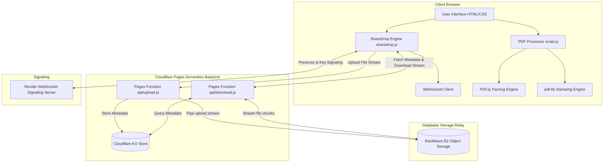

# ⚡ LABLAZY - Web Suite & P2P ShareDrop

[](https://pages.cloudflare.com/)
[](https://webrtc.org/)
[](https://mozilla.github.io/pdf.js/)
[](LICENSE)

**LABLAZY** is an all-in-one web application suite featuring an automated **Client-Side PDF Document Editor & Metadata Stamper** alongside **ShareDrop**, a high-performance **Peer-to-Peer (P2P) File Sharing System** built with custom WebSocket signaling and an integrated Cloudflare Pages + Backblaze B2 secure database fallback.

---

## 🌟 Key Features

### 📄 1. Automated PDF Editor & Metadata Stamper
* **Batch Processing:** Process multiple PDF files simultaneously right in your browser with zero server uploads.
* **Smart Text Detection (PDF.js):** Scans multi-page PDFs to detect baseline coordinates of student headers (Name, Moodle ID, Roll No, Class/Div/Branch, Subject, Instructor, Dates, Experiment Numbers).
* **Precise Canvas Whiteout & Re-Stamping (`pdf-lib`):** Erases old text fields with exact bounding-box whiteouts and redraws cleanly formatted Times New Roman Bold text across every page.
* **Direct Transfer to ShareDrop:** Transferred PDFs are cached in browser memory and imported instantly into the PDF Editor with a single click.
* **ZIP Archive Generation:** Compress all stamped PDFs into a single `.zip` file using JSZip for batch submission.

### ⚡ 2. ShareDrop (P2P File Transfer & Direct Share)
* **Zero-Server Storage:** Files stream directly from sender to receiver. Files are not stored on third-party servers permanently (10-minute temporary B2 proxy buffer).
* **Direct Active Receivers List**: Senders can toggle a list of active receivers in the room and direct-share files with a single click (triggering an accept/decline dialog on the receiver's end).
* **Dynamic Connection Notice Board**: Shows a real-time warning card if the connection is lost. Auto-switches to yellow warning mode (allowing manual 6-digit key transfers while WebSocket is offline) or red error mode (if backend database is offline).
* **Fault-Tolerant Retries**:
  * **Upload Autoretry**: Retries uploads up to 2 times automatically if a network dropout or timeout occurs.
  * **Database Sync Retry**: Polls the server database for up to 5 seconds if a receiver inputs a code before KV database replication finishes.
  * **Low-Memory Protection**: Detects mobile and low-RAM devices, recommending single-file transfers if zipping files >35MB to prevent browser crashes.
* **Integrated Real-Time Chat:** Built-in WebSocket chat room per room code for messaging while sharing.

---

## 🏗️ Architecture & Tech Stack



| Component | Technology Used | Description |
| :--- | :--- | :--- |
| **Frontend UI** | HTML5, Vanilla CSS3 (Space Grotesk & Inter) | Neo-Brutalist responsive layout with custom theme toggle and 3D tilt cards. |
| **PDF Parser** | `PDF.js` (Mozilla) | Client-side text layer baseline coordinate & bounds detection. |
| **PDF Modifier** | `pdf-lib` | Standard font embedding, rectangle wiping, and coordinate text stamping. |
| **Relay Database** | Backblaze B2 | Serverless high-speed temporary storage buffer (10 min TTL). |
| **Signaling** | WebSockets (Hosted on Render) | Real-time presence, classmate discovery, and one-click key sharing. |
| **Storage & Zip** | Cloudflare KV, IndexedDB & `JSZip` | Client-side and server-side temporary file lookup, caches, and uncompressed STORE zipping. |

---

## 📁 Repository Structure

```
d:/PDF/website/
├── index.html              # Main application shell (PDF Editor + ShareDrop tabs)
├── sharedrop.html          # Redirect entrypoint for ShareDrop direct URLs
├── config.js               # Global configuration (Signaling server, local overrides)
├── script.js               # Client-side PDF processing, regex detection, and IndexedDB handler
├── sharedrop.js            # ShareDrop matchmaking logic, upload/download retries, notice toggles
├── chat.js                 # Real-time WebSocket chat room module & connection dispatcher
├── styles.css              # Main design system tokens and PDF editor styling
├── sharedrop.css           # ShareDrop brutalist card grid and modal styles
├── libs/                   # Local minified JS libraries (PDF.js, pdf-lib, JSZip)
├── functions/              # Cloudflare Pages Functions backend folder
│   └── api/
│       ├── upload.js       # Handles streaming uploads to B2 and PIN generation in KV
│       └── download.js     # Handles PIN verification and streaming downloads from B2
└── favicon/                # Web app icons and manifest
```

---

## ⚙️ Cloudflare Pages & Database Deployment Guide

Follow these step-by-step instructions to host the repository on **Cloudflare Pages** and configure the **Backblaze B2** database storage:

### Step 1: Create a Backblaze B2 Account & Bucket
1. Go to [Backblaze](https://www.backblaze.com/) and create a free account.
2. Go to the **B2 Cloud Storage** page and click **Create a Bucket**.
3. Set your bucket name (e.g., `lablazy-transfers`) and make it **Private**. Click **Create Bucket**.
4. Take note of the **Bucket ID** and **Bucket Name** listed on the dashboard.
5. In the left navigation, click **App Keys**.
6. Scroll down and click **Add a New Application Key**. Name it `lablazy-key` and leave the settings as default.
7. Click **Create Key** and copy the **keyID** and **applicationKey** immediately (the applicationKey secret is only shown once).

### Step 2: Set up a Github Repository
1. Initialize git in the repository directory (make sure the project root containing the `website/` directory is tracked).
2. Create a new repository on GitHub.
3. Push your files to GitHub:
   ```bash
   git init
   git add .
   git commit -m "Deploying Lablazy Web App"
   git remote add origin YOUR_GITHUB_REPOSITORY_URL
   git branch -M main
   git push -u origin main
   ```

### Step 3: Deploy to Cloudflare Pages
1. Log in to the [Cloudflare Dashboard](https://dash.cloudflare.com/).
2. In the sidebar, select **Workers & Pages**, and click **Create** -> **Pages** tab -> **Connect to Git**.
3. Select your GitHub repository and click **Begin setup**.
4. Configure Build settings:
   * **Project Name**: `lablazy`
   * **Framework Preset**: `None`
   * **Build command**: Leave blank (no build command needed).
   * **Root directory**: `/website` (This ensures only the frontend website and the `functions` folder are built).
5. Click **Save and Deploy**.

### Step 4: Configure Cloudflare KV Database
1. Go back to your Cloudflare Dashboard -> **Workers & Pages** -> **KV**.
2. Click **Create Namespace**. Name it `PANIC_STATE` and click **Add**.
3. Go back to **Workers & Pages** -> **Pages** -> Click your **lablazy** project.
4. Select the **Settings** tab at the top -> **Functions** -> Scroll down to **KV Namespace Bindings**.
5. Click **Add binding**:
   * **Variable Name**: `PANIC_STATE`
   * **KV Namespace**: Select your `PANIC_STATE` namespace from the dropdown.
6. Click **Save**.

### Step 5: Configure Environment Secrets
1. In your project settings, click **Settings** tab -> **Environment Variables**.
2. Click **Add variables** under **Production** (and optionally Preview) and add the following 4 keys from **Step 1**:
   * `B2_KEY_ID` = *Your Backblaze App Key ID*
   * `B2_APPLICATION_KEY` = *Your Backblaze Application Key Secret*
   * `B2_BUCKET_ID` = *Your Backblaze Bucket ID*
   * `B2_BUCKET_NAME` = *Your Backblaze Bucket Name*
3. Click **Save**.
4. Go to the **Deployments** tab at the top, click the three dots next to your latest deployment, and click **Retry deployment** to apply the new environment variables and KV bindings.

---

## 🚀 Local Development Setup

To run and test the website locally with its serverless functions:

1. Install Node.js on your computer.
2. Install Cloudflare Wrangler globally:
   ```bash
   npm install -g wrangler
   ```
3. Run Pages local dev server:
   ```bash
   wrangler pages dev website --kv=PANIC_STATE
   ```
4. Open the displayed local server URL (e.g. `http://localhost:8788`) in your browser.

---

## 📜 License

Distributed under the MIT License. See `LICENSE` for details.
